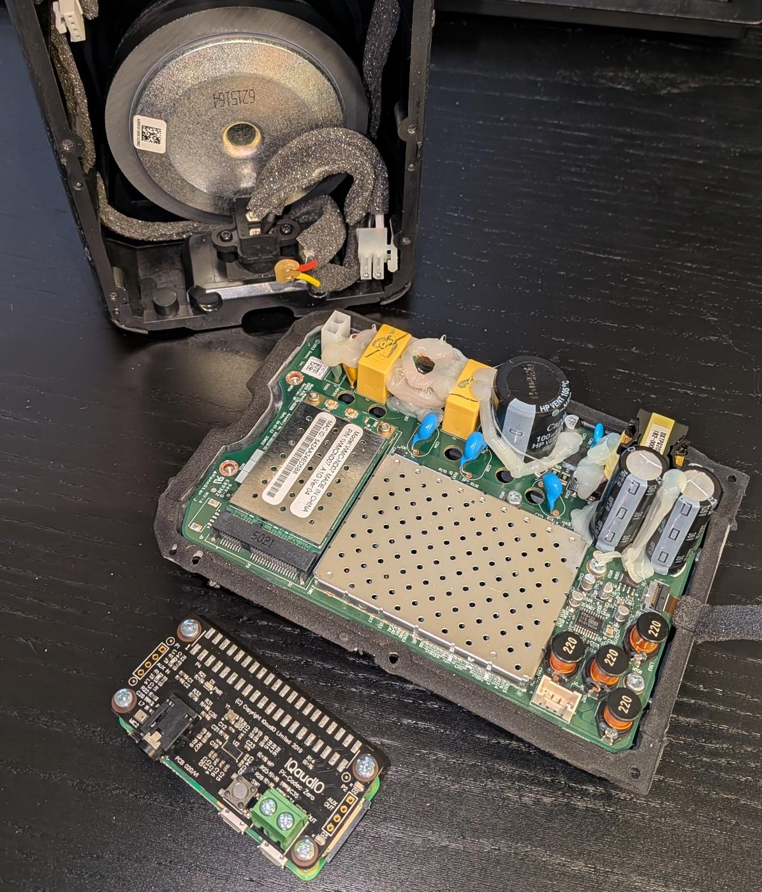
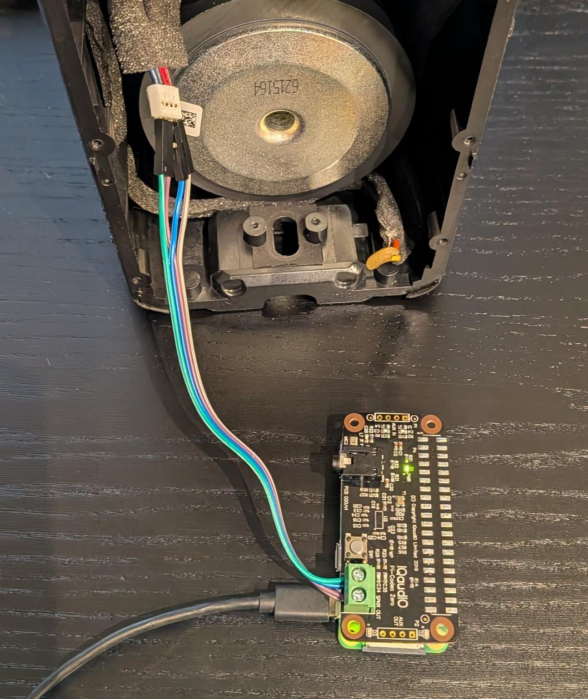
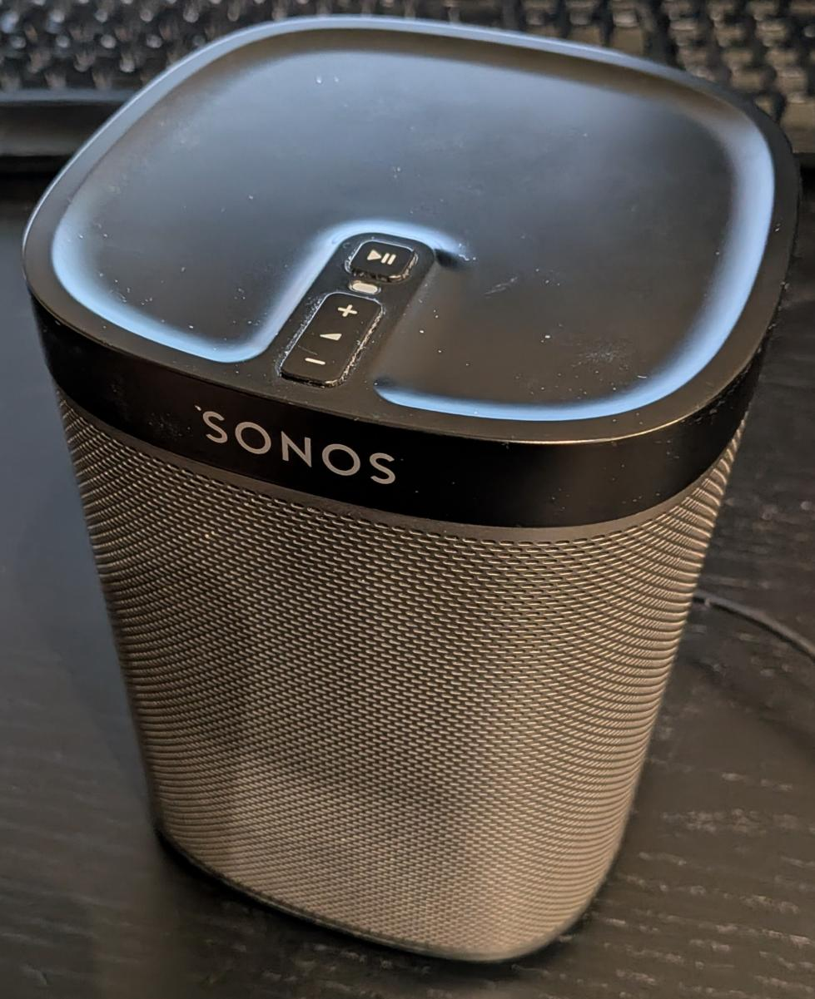
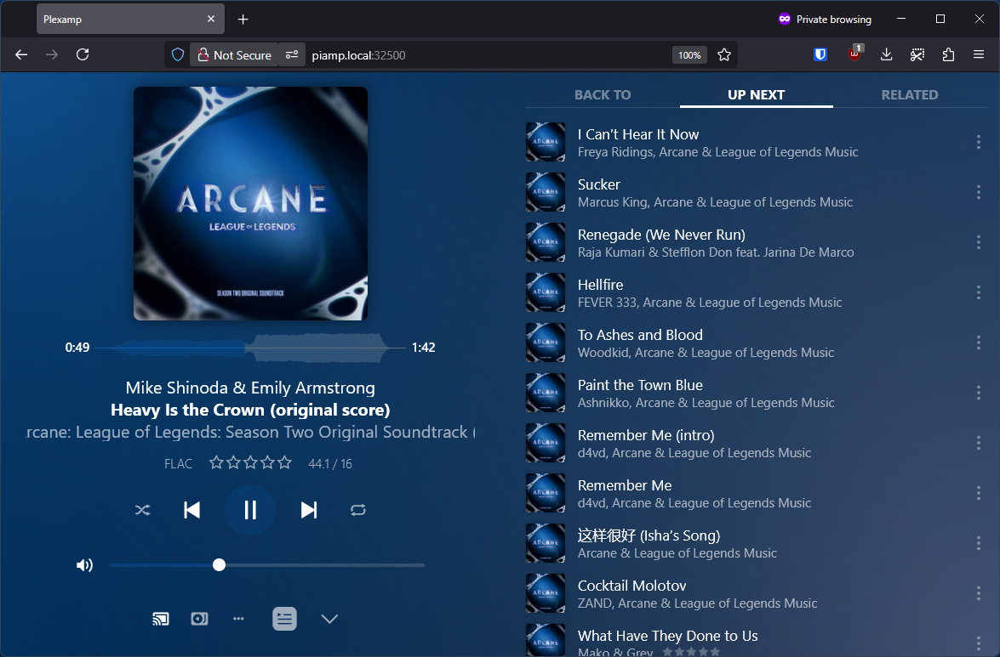
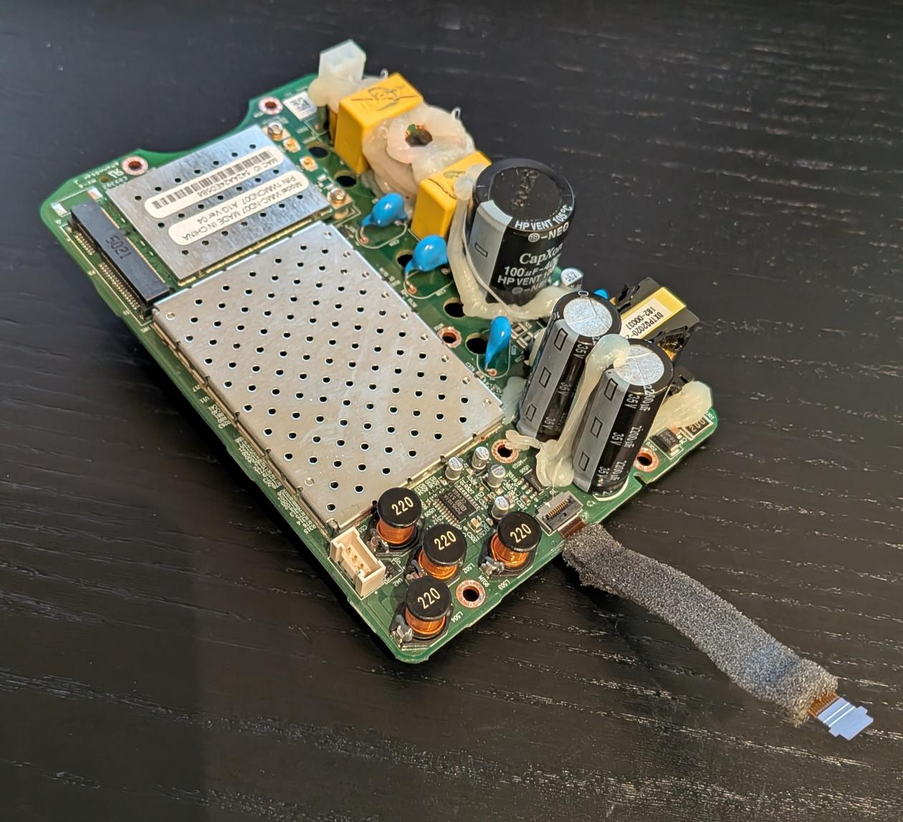

# piamp - unenshittificating Sonos Play:1

After great [enshittification][] of Sonos in 2024 my [Sonos Play:1][] speaker was kind of useless.

No difference between these two:


My use case was very simple - just play music from Plex server, I don't need any fancy
multiroom speaker setup. So I wired up speaker with Raspberry Pi Zero 2 W and used
headless [Plexamp][] to make it useful again.


# Requirements

1) [Plex Pass][] to use Plexamp with your Plex server.

2) [Raspberry Pi Zero 2 W][] will run headless connected to wifi.

3) [Raspberry Pi Codec Zero][] to connect speaker.

4) sdcard (at least 4GB), usb power adapter + cable.


# Prepare sdcard

Edit [piamp-setup.sh][] script to set settings on the top - mainly sdcard device name, wifi name & password.

Run the setup script with sudo: `sudo ./piamp-bootstrap.sh` (works only under Arch Linux)

This will format sdcard & bootstrap minimal [Arch Linux ARM][] installation. The setup will autoconnect to specified wifi.

It'll download [headless Plexamp][] to `/opt/plexamp`.


# Disassembling Sonos Play:1

See teardown instructions: https://www.ifixit.com/Device/Sonos_Play_1

Raspberry Pi Zero 2 with Codec Zero next to Sonos board it will replace:



Raspberry connected to speakers:



No idea what I'm doing with this wiring, I was hoping it'll just work and it did. Don't expect great sound quality
as originally Sonos provides different output for bass and small speaker, but Codec Zero has only mono output. Fixing
this would require using one of bigger Raspberry DAC HATs and tweaking alsa output config. 

Everyting assembled back together:




# Software setup

Connect USB power, wait ~10 seconds then connect with ssh:

```
ssh piamp@piamp.local
```

Default password is `piamp`

Run `node /opt/plexamp/js/index.js` to register Plexamp client. It will ask to claim client at https://plex.tv/claim

Copy the code, and enter device name.

After script exits, start the service - this will make it autostart on boot:

```
sudo systemctl enable --now plexamp
```

You can close the ssh session. Open http://piamp.local:32500/ in browser to continue setup.

Select music library, and everything is done! Play music connected from browser, desktop app or mobile Plexamp client.




This now goes into trash:




# TODO

It would be nice to connect play/pause & volume buttons to GPIO's. Requires a bit of soldering.

Soldering external antenna to Raspberry Pi might be useful, but so far I had no issues with wifi signal strength.


[enshittification]: https://www.theverge.com/2025/1/13/24342282/sonos-app-redesign-controversy-full-story
[Sonos Play:1]: https://support.sonos.com/en-us/products/play-1
[Plexamp]: https://www.plex.tv/plexamp/
[Plex Pass]: https://www.plex.tv/plex-pass/
[Raspberry Pi Zero 2 W]: https://www.raspberrypi.com/products/raspberry-pi-zero-2-w/
[Raspberry Pi Codec Zero]: https://www.raspberrypi.com/products/codec-zero/
[piamp-setup.sh]: piamp-setup.sh
[Arch Linux ARM]: https://archlinuxarm.org/
[headless Plexamp]: https://forums.plex.tv/t/plexamp-on-the-raspberry-pi/791500
